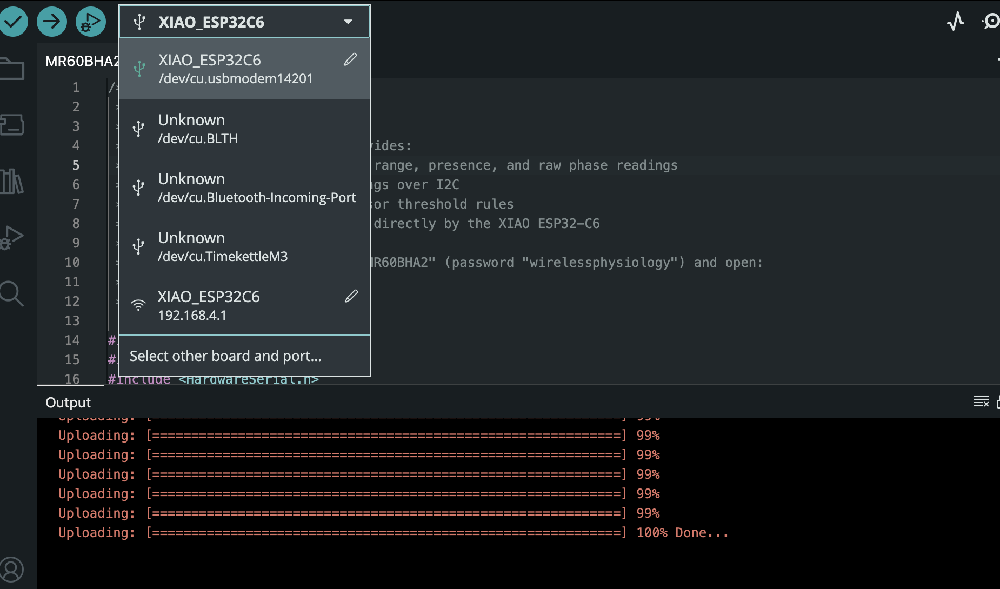

# MR60BHA2 Sensor VisLog

## Summary

MR60BHA2 Sensor VisLog is a quick-setup radar console for the Seeed MR60BHA2 on a XIAO ESP32-C6. It is meant for initial testing, live sensing, and data logging before you build a larger app around the hardware.

It can collect:

- presence and target count
- range, angle, and speed for tracked targets
- heart rate and breathing rate
- total, breathing, and heart motion phase
- ambient light
- firmware and device status
- local RGB LED state and threshold-rule output


This is the main live view you should expect when the system is running.

## Hardware

1. Seeed Studio 60 GHz mmWave sensor module pack
2. USB-C to USB-C cable
3. USB-C battery pack
4. Phone stand

Buy links:

- Seeed Studio search for the module pack: https://www.seeedstudio.com/catalogsearch/result/?q=MR60BHA2
- Seeed Studio search for the XIAO ESP32C6 board: https://www.seeedstudio.com/catalogsearch/result/?q=XIAO%20ESP32C6


## Reference Links

- Seeed MR60BHA2 datasheet PDF: https://files.seeedstudio.com/wiki/mmwave-for-xiao/mr60/datasheet/MR60BHA2_Breathing_and_Heartbeat_Module.pdf
- Seeed wiki home: https://wiki.seeedstudio.com/ and search for `MR60BHA2`
- Seeed mmWave Arduino library: https://github.com/Seeed-Studio/Seeed_Arduino_mmWave
- Arduino IDE download: https://www.arduino.cc/en/software
- Arduino Boards Manager guide: https://docs.arduino.cc/software/ide-v2/tutorials/ide-v2-board-manager
- Arduino Library Manager guide: https://docs.arduino.cc/software/ide-v2/tutorials/ide-v2-library-manager

## Repo Layout

```text
firmware/mr60bha2_console/
  platformio.ini
  src/main.cpp
  data/index.html
quicksetup/
  legacy Arduino sketch and notes
docs/images/
  screenshots and setup photos used below
LICENSE
```

## Quick Setup

### Arduino IDE

This is the fastest path for first bring-up and hardware testing.

#### 1. Install the tools

Install these first:

1. Arduino IDE 2.x
2. ESP32 board support package from Espressif through Boards Manager
3. `Seeed_Arduino_mmWave` through Library Manager

#### 2. First flash over USB

Open the legacy sketch and flash it with USB connected:

1. `quicksetup/MR60BHA2_Sensor_VisLog/MR60BHA2_Sensor_VisLog.ino`
2. In Tools > Board, choose `XIAO ESP32C6` from the ESP32 board list
3. If `XIAO ESP32C6` is missing, open Boards Manager and install or update the Espressif ESP32 package, then reload the board list
4. Select the correct USB serial port in Tools > Port
5. Match the board settings shown in the screenshot below
6. Upload the sketch over the wired USB connection





Use these exact firmware values in your setup notes:

```cpp
static const char *WIFI_AP_SSID = "mmWaveVisLog-MR60BHA2";
static const char *WIFI_AP_PASSWORD = "wirelessphysiology";
static const char *OTA_HOSTNAME = "mmWaveVisLog-MR60BHA2-OTA";
static const char *OTA_PASSWORD = "wp-ota";
static const char *VisLog_FW_VERSION = "2.1.4";
```

#### 3. Update over Wi-Fi with OTA

OTA is optional. Use it for small tweaks when you do not want to reconnect USB-C every time.

After the wired flash succeeds:

1. Connect to `mmWaveVisLog-MR60BHA2`
2. Use password `wirelessphysiology`
3. Wait up to 2 minutes for the OTA port to appear in Arduino IDE
4. Select the OTA port once it shows up
5. Upload the updated sketch over Wi-Fi

Important:

- OTA hostname: `mmWaveVisLog-MR60BHA2-OTA`
- If the OTA port is not visible immediately, keep waiting for the full 2 minutes before retrying

### PlatformIO

This repo’s main firmware lives in PlatformIO format.

```sh
cd firmware/mr60bha2_console
pio run
pio run --target upload
pio run --target uploadfs
pio device monitor
```

## Open The UI

Connect to the device Wi-Fi:

- SSID: `mmWaveVisLog-MR60BHA2`
- Password: `wirelessphysiology`
- UI: `http://192.168.4.1/`
- OTA hostname: `mmWaveVisLog-MR60BHA2-OTA`
- OTA password: `wp-ota`

What you should expect in the UI:

- `Radar target tracking` is the main live view for one subject.
- `Multi-target tracking` shows multiple people or objects in range.
- `Range, angle, and speed history` is the quickest way to see motion toward or away from the sensor.
- `LED control and threshold rules` lets the local LED follow a sensor condition.
- `Session logger` records named captures and exports JSON.

### Plot Controls


Use the plot window selector to switch between 18, 36, and 72 seconds of history.

Use the noise/stability band selector to show the rolling 12-point band at `off`, `+/- 1 sigma`, `+/- 2 sigma`, or `+/- 3 sigma`.

Use `Reset plots` to clear the graph history and start a fresh capture.

### Radar Target Tracking


Use this view for a single subject. It shows presence, target count, range, angle, speed, and the heart and breathing plots.

### Multi-Target Tracking


Use this view when more than one person is in range. It is useful for rear-seat monitoring or room occupancy checks.

### Multi-Target Plot Colors


The target colors are consistent across the charts:

- Target 1: red
- Target 2: orange
- Target 3: green

### Range, Angle, and Speed History


Use this section to watch whether a target is stable, moving closer, or moving farther away.

### LED Control and Threshold Rules


Use this section to drive the status LED manually or tie it to a measurement threshold.

### Session Logger


Use this section to name a run, record it, and export JSON for later review.

## License

This repository is licensed under the MIT License. See [LICENSE](LICENSE).
