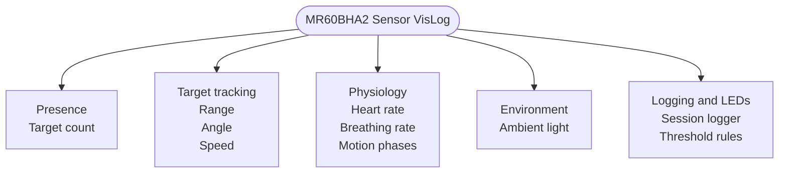
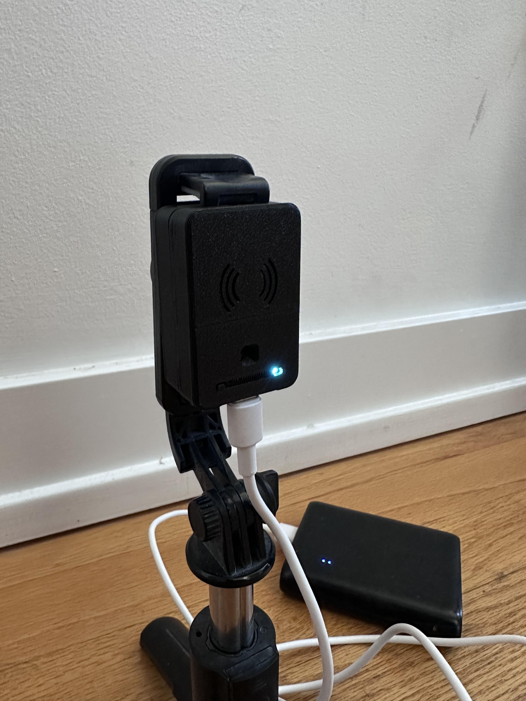
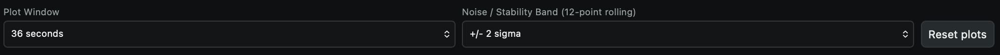
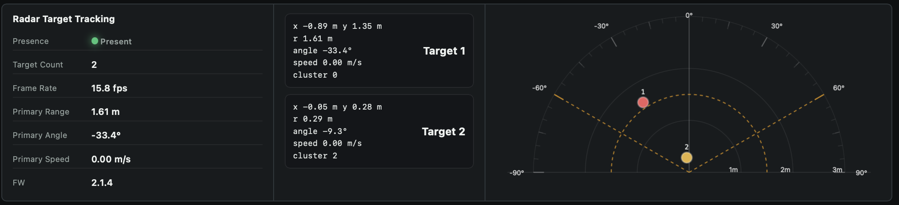
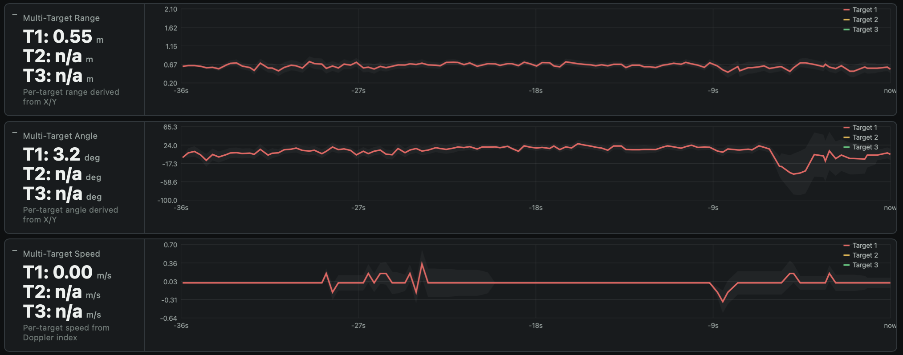
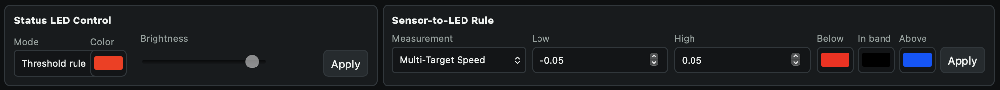
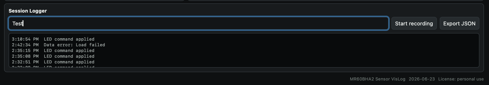

# MR60BHA2 Sensor VisLog

## Summary

MR60BHA2 Sensor VisLog is a local radar console for the Seeed MR60BHA2 on a
XIAO ESP32-C6. The maintained product runtime lives in
`zephyr/mmwavevizlog-runtime/`. The Arduino project under
`arduino/mmwavevizlog-quickstart/` is the quick-start bring-up path: it was the
first base implementation used to get the hardware, wiring, Wi-Fi, OTA, and UI
working before the Zephyr runtime was built, and it remains the easiest path for
others to follow when first powering up the device.

This repository is scoped as an embedded sensing software platform. It covers
firmware, protocol, validation, release management, and developer workflow.
Mechanical enclosure, battery, thermal, charging, skin-contact, and wearable
product integration work belongs in a separate hardware/product repository.

It can collect:

- presence and target count
- range, angle, and speed for tracked targets
- heart rate and breathing rate
- total, breathing, and heart motion phase
- ambient light
- firmware and device status
- local RGB LED state and threshold-rule output

The live JSON sample endpoint is `GET /api/sample`.

## What this demonstrates

This repository demonstrates embedded product-software development for a compact sensing device:

- Zephyr firmware architecture for XIAO ESP32-C6
- Arduino quick-start path for first-boot hardware bring-up
- UART radar-frame parsing with saved binary fixture tests
- I2C ambient-light integration
- schema-compatible JSON sample streaming
- local Wi-Fi dashboard and browser session logging
- local LED feedback and threshold rules
- OTA/release workflow with signed firmware artifacts
- CI-managed parser tests, schema validation, and firmware builds
- software requirements, validation, release-management, and protocol documentation




## Software platform docs

| Document | Purpose |
| --- | --- |
| [`docs/software-architecture.md`](docs/software-architecture.md) | System-level software architecture and repository scope. |
| [`docs/firmware-module-map.md`](docs/firmware-module-map.md) | Firmware module responsibilities and verification hooks. |
| [`docs/software-requirements.md`](docs/software-requirements.md) | Software requirements and traceability. |
| [`docs/software-validation-plan.md`](docs/software-validation-plan.md) | Software validation matrix and manual validation checklist. |
| [`docs/dashboard-api-validation.md`](docs/dashboard-api-validation.md) | Dashboard and local API validation procedure. |
| [`docs/release-management.md`](docs/release-management.md) | Release gates, versioning, and artifact verification. |
| [`protocol/README.md`](protocol/README.md) | Protocol overview, compatibility rules, units, and null handling. |
| [`CHANGELOG.md`](CHANGELOG.md) | Planned and released software-platform changes. |

## Runtime Paths

| Path | Purpose | When to use |
| --- | --- | --- |
| `zephyr/mmwavevizlog-runtime/` | Main product/runtime firmware | Use this for maintained firmware builds, CI, signed release artifacts, OTA flow, parser tests, and protocol-aligned runtime work. |
| `arduino/mmwavevizlog-quickstart/` | Quick-start bring-up and reference firmware | Use this first when validating wiring, board selection, sensor behavior, Wi-Fi AP behavior, LED output, and the UI on a new hardware setup. |

The Arduino path is intentionally kept simple and approachable. It is not the
long-term release target, but it is useful for fast hardware verification and
for users who want to get the device running before installing the full Zephyr
toolchain.

## Versioning

Releases use semantic-style tags in the form `vA.B.C`.

- `A` is the major version. Increase this for breaking protocol, hardware, or
  firmware behavior changes.
- `B` is the minor version. Increase this for new features that remain mostly
  compatible.
- `C` is the patch version. Increase this for fixes, documentation updates,
  CI fixes, and small compatibility improvements.

Current prepared release target: `v0.2.0`.

For this repo, `0.x.y` means the project is still in active prototype/runtime
bring-up. The Zephyr app `VERSION`, Arduino reference firmware version, protocol
examples, and GitHub release tag should stay aligned when practical.

## JSON Output

Fields returned by the runtime sample stream:

| JSON field | Meaning |
| --- | --- |
| `heart_rate` | Heart rate in bpm, or `null`. |
| `breath_rate` | Breathing rate in rpm, or `null`. |
| `distance` | Normalized metres, or `null`. |
| `raw_distance` | Raw radar distance reading, or `null`. |
| `total_phase` | Total motion phase, or `null`. |
| `breath_phase` | Breathing-filtered motion phase, or `null`. |
| `heart_phase` | Heartbeat-filtered motion phase, or `null`. |
| `presence` | Presence flag. |
| `presence_valid` | Whether the presence value is valid. |
| `presence_source` | Presence source label such as `sensor`, `waiting`, or `stale`. |
| `target_valid` | Whether target tracking data is valid. |
| `target_source` | Target source label such as `sensor`, `waiting`, or `stale`. |
| `people_count` | Target count, mirrored for compatibility. |
| `target_count` | Target count. |
| `target_x` | Primary target X position in metres, or `null`. |
| `target_y` | Primary target Y position in metres, or `null`. |
| `target_distance` | Primary target distance in metres, or `null`. |
| `target_angle` | Primary target angle in degrees, or `null`. |
| `target_speed` | Primary target speed in m/s, or `null`. |
| `targets` | Array of tracked targets with `x`, `y`, `distance`, `angle`, `speed`, `dop_index`, and `cluster_index`. |
| `light` | Ambient light in lux, or `null`. |
| `light_ready` | Whether the BH1750 light sensor is ready. |
| `console_fw` | Console firmware version string. |
| `firmware_valid` | Whether the radar firmware value parsed correctly. |
| `firmware_raw` | Raw radar firmware value. |
| `firmware_project` | Parsed radar firmware project field. |
| `firmware_major` | Parsed radar firmware major version. |
| `firmware_sub` | Parsed radar firmware sub version. |
| `firmware_modified` | Parsed radar firmware modified field. |
| `led_r` | Current LED red channel value. |
| `led_g` | Current LED green channel value. |
| `led_b` | Current LED blue channel value. |
| `frame` | Frame counter. |
| `last_radar_ms` | Milliseconds since the last radar update. |
| `uptime_ms` | Device uptime in milliseconds. |

## Hardware

1. Seeed Studio 60 GHz mmWave sensor module pack
2. USB-C to USB-C cable
3. USB-C battery pack
4. Phone stand

Where to buy:

- Seeed Studio search for the module pack: https://www.seeedstudio.com/catalogsearch/result/?q=MR60BHA2
- Seeed Studio search for the XIAO ESP32C6: https://www.seeedstudio.com/catalogsearch/result/?q=XIAO+ESP32C6
- Seeed mmWave product and module listings: https://www.seeedstudio.com/

## Hardware Pins

These are the pins used by the Arduino bring-up path and preserved by the
Zephyr runtime overlay.

| Hardware pin | GPIO |
| --- | --- |
| MR60BHA2 UART RX | `GPIO17` |
| MR60BHA2 UART TX | `GPIO16` |
| WS2812 RGB LED | `GPIO1` |
| BH1750 I2C SDA | `GPIO22` |
| BH1750 I2C SCL | `GPIO23` |



## Safety and Exposure

This project uses the Seeed MR60BHA2, a low-power 60 GHz radar module. The module datasheet lists 3.3 V operation, about 600 mA typical current, and 12 dBm transmit power, so the RF source is designed for sensing rather than high-power transmission.

What the current literature and exposure guidance support:

- 60 GHz RF is non-ionizing.
- Interaction with the body is shallow and concentrated near the skin surface, not deep tissue.
- Above-6 GHz exposure limits are set to prevent excessive tissue heating.
- For compliant low-power use, the main known risk is local heating if the device is misused or driven beyond spec.

What this means for this repo:

- The sensor is appropriate for monitoring and research-style prototyping, including presence, breathing, and heartbeat estimation.
- It should not be described as a medical treatment device.
- For long-term bedside or in-vehicle use, follow the module datasheet, keep the hardware powered within spec, and avoid claiming zero risk.

Selected reading and public links:

- Seeed MR60BHA2 technical specification: [PDF](https://files.seeedstudio.com/wiki/mmwave-for-xiao/mr60/datasheet/MR60BHA2_Breathing_and_Heartbeat_Module.pdf)
- Wu, Rappaport, and Collins, *The Human Body and Millimeter-Wave Wireless Communication Systems: Interactions and Implications*: [arXiv](https://arxiv.org/abs/1503.05944)
- Hirata et al., *Human Exposure to Radiofrequency Energy above 6 GHz: Review of Computational Dosimetry Studies*: [arXiv](https://arxiv.org/abs/2011.10699)
- Nasim, Kim, and Sharif, *Human Electromagnetic Field Exposure in Wearable Communications: A Review*: [arXiv](https://arxiv.org/abs/1912.05282)
- FCC radio frequency safety guidance: [fcc.gov/general/radio-frequency-safety-0](https://www.fcc.gov/general/radio-frequency-safety-0)

## Reference Links

- Seeed MR60BHA2 datasheet PDF: https://files.seeedstudio.com/wiki/mmwave-for-xiao/mr60/datasheet/MR60BHA2_Breathing_and_Heartbeat_Module.pdf
- Seeed wiki home: https://wiki.seeedstudio.com/ and search for `MR60BHA2`
- Seeed mmWave Arduino library: https://github.com/Seeed-Studio/Seeed_Arduino_mmWave
- Arduino IDE download: https://www.arduino.cc/en/software
- Arduino Boards Manager guide: https://docs.arduino.cc/software/ide-v2/tutorials/ide-v2-board-manager
- Arduino Library Manager guide: https://docs.arduino.cc/software/ide-v2/tutorials/ide-v2-library-manager

## Repo Layout

```text
arduino/mmwavevizlog-quickstart/
  Arduino quick-start bring-up and hardware-reference firmware
docs/
  software architecture, requirements, validation, API, and release management
images/
  screenshots and setup photos used by the documentation
protocol/
  JSON schema, examples, and serial stream notes
zephyr/mmwavevizlog-runtime/
  maintained Zephyr product/runtime firmware
LICENSE
README.md
```

Do not commit local build products, Zephyr workspaces, editor caches, macOS
metadata files, or local device credential overrides.

## Quick Setup

### Arduino Quick-Start Bring-Up

Use this first when you need a minimal path to confirm the sensor wiring, board
selection, Wi-Fi AP, OTA behavior, LED behavior, and dashboard before working on
the maintained Zephyr runtime.

1. Install Arduino IDE 2.x.
2. Install the Espressif ESP32 board package in Boards Manager.
3. Install `Seeed_Arduino_mmWave` in Library Manager. (https://github.com/Love4yzp/Seeed-mmWave-library)
4. Open `arduino/mmwavevizlog-quickstart/mmwavevizlog-quickstart.ino`.
5. Select `XIAO ESP32-C6` and the correct serial port.
6. Upload once over USB, then use OTA if you want wireless updates.
   After upload, give the board a few seconds to bring up Wi-Fi and OTA before assuming it failed.
   OTA only works after the sketch is already running and the board is reachable on its Wi-Fi AP.

Optional local credential override:

1. Copy `arduino/mmwavevizlog-quickstart/vislog_private_config.example.h` to
   `arduino/mmwavevizlog-quickstart/vislog_private_config.h`.
2. Change `VISLOG_WIFI_AP_PASSWORD` and `VISLOG_OTA_PASSWORD` in the copied file.
3. Keep `vislog_private_config.h` local. It is ignored by Git.

The committed passwords are development defaults for an easy first boot. Change
them before sharing a device outside your own test setup.

### Zephyr Maintained Runtime

Use Zephyr for the maintained product/runtime firmware path in this repository.

1. Install the Zephyr workspace and toolchain described in
   [`zephyr/mmwavevizlog-runtime/README.md`](zephyr/mmwavevizlog-runtime/README.md).
2. Build the app from the repository root:

   ```sh
   cd /Users/username/Documents/GitHub/mmWaveVizLog
   export ZEPHYR_BASE="$PWD/zephyr/workspace/zephyr"
   export ZEPHYR_TOOLCHAIN_VARIANT=zephyr
   west build -b xiao_esp32c6/esp32c6/hpcore zephyr/mmwavevizlog-runtime
   ```

3. Flash the board with the connected USB-C cable.
4. Open the dashboard at `http://192.168.4.1/` after connecting to the device AP.

## Release Process

The release workflow runs on tags matching `v*.*.*` or by manual dispatch.
It builds the parser test, validates protocol examples, builds the real XIAO
ESP32-C6 Zephyr firmware, verifies `zephyr.signed.bin`, uploads workflow
artifacts, and publishes a GitHub Release.

Normal release flow for the prepared software-platform release:

```sh
git checkout main
git pull
git tag v0.2.0
git push origin v0.2.0
```

The release should include:

- signed XIAO ESP32-C6 Zephyr firmware binary
- Zephyr ELF and map files
- native simulator parser executable
- protocol JSON schema
- protocol JSON examples

See [`docs/release-management.md`](docs/release-management.md) for release gates, artifact verification, and rollback guidance.

## Troubleshooting

If the upload fails or the board does not come back on Wi-Fi after flashing the XIAO ESP32-C6, put it into bootloader mode and try again:

1. Unplug USB.
2. Hold the `BOOT` button.
3. While holding `BOOT`, plug USB back in.
4. Keep holding for about 1 to 2 seconds after it powers up, then release.
5. Start the upload again.

## Open The UI

Connect to the device Wi-Fi:

- SSID: `mmWaveVisLog-MR60BHA2-123MACID`
- Default password: `wirelessphysiology`
- UI: `http://192.168.4.1/`
- OTA hostname: `mmWaveVisLog-MR60BHA2-OTA`
- Default OTA password: `wp-ota`

These are development defaults. Override them with local
`vislog_private_config.h` for private devices or shared demos.

After upload or reset, Wi-Fi and OTA can take a few seconds to appear. If the access point or OTA target is not visible immediately, wait briefly before retrying.

What you should expect in the UI:

- `Radar target tracking` is the main live view for one subject.
- `Multi-target tracking` shows multiple people or objects in range.
- `Range, angle, and speed history` is the quickest way to see motion toward or away from the sensor.
- `LED control and threshold rules` lets the local LED follow a sensor condition.
- `Session logger` records named captures and exports JSON.

### Plot Controls



Use the plot window selector to switch between 18, 36, and 72 seconds of history.

Use the noise/stability band selector to show the rolling 12-point band at `off`, `+/- 1 sigma`, `+/- 2 sigma`, or `+/- 3 sigma`.

Use `Reset plots` to clear the graph history and start a fresh capture.

### Radar Target Tracking


Use this view for a single subject. It shows presence, target count, range, angle, speed, and the heart and breathing plots.

### Multi-Target Tracking



Use this view when more than one person is in range. It is useful for rear-seat monitoring or room occupancy checks.

### Multi-Target Plot Colors



The target colors are consistent across the charts:

- Target 1: red
- Target 2: orange
- Target 3: green

### Range, Angle, and Speed History


Use this section to watch whether a target is stable, moving closer, or moving farther away.

### LED Control and Threshold Rules



Use this section to drive the status LED manually or tie it to a measurement threshold.

### Session Logger



Use this section to name a run, record it, and export JSON for later review.

## License

This repository is licensed under the MIT License. See [LICENSE](LICENSE).
