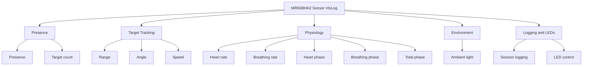

# MR60BHA2 Sensor VisLog

## Summary

MR60BHA2 Sensor VisLog is a quick-setup radar console for the Seeed MR60BHA2 on a XIAO ESP32-C6. It is meant for initial testing, live sensing, and data logging without needing a full custom app first.

It can collect:

- presence and target count
- range, angle, and speed for tracked targets
- heart rate and breathing rate
- total, breathing, and heart motion phase
- ambient light
- firmware and device status
- local RGB LED state and threshold-rule output



## Hardware

1. Seeed Studio 60 GHz mmWave sensor module pack
2. USB-C to USB-C cable
3. USB-C battery pack
4. Phone stand


## Reference Docs

- Seeed datasheet PDF: https://files.seeedstudio.com/wiki/mmwave-for-xiao/mr60/datasheet/MR60BHA2_Breathing_and_Heartbeat_Module.pdf
- Seeed wiki: https://wiki.seeedstudio.com/ , then search for MR60BHA2

The main firmware comments and frame notes also reflect the installed Seeed Arduino mmWave library used by this repo.

## Repo Layout

```text
firmware/mr60bha2_console/
  platformio.ini
  src/main.cpp
  data/index.html
quicksetup/
  legacy Arduino sketch and notes
docs/images/
  screenshots and setup photos used below
LICENSE
```

## Quick Setup

### Arduino IDE

This is the fastest path for first bring-up and hardware testing.

Install:

1. Arduino IDE 2.x
2. ESP32 board support package from Espressif
3. `Seeed_Arduino_mmWave` from Library Manager

Open:

1. `quicksetup/MR60BHA2_Sensor_VisLog/MR60BHA2_Sensor_VisLog.ino`
2. Select board `XIAO ESP32C6`
3. Select the correct USB serial port
4. Match the board settings shown in the screenshot below
5. Upload the sketch


Use these exact firmware values in your setup notes:

```cpp
static const char *WIFI_AP_SSID = "mmWaveVisLog-MR60BHA2";
static const char *WIFI_AP_PASSWORD = "wirelessphysiology";
static const char *OTA_HOSTNAME = "mmWaveVisLog-MR60BHA2-OTA";
static const char *OTA_PASSWORD = "wp-ota";
static const char *VisLog_FW_VERSION = "2.1.4";
```

### PlatformIO

This repo’s main firmware lives in PlatformIO format.

```sh
cd firmware/mr60bha2_console
pio run
pio run --target upload
pio run --target uploadfs
pio device monitor
```

The images in `docs/images/` were re-saved without embedded EXIF or location metadata.

## Open The UI

Connect to the device Wi-Fi:

- SSID: `mmWaveVisLog-MR60BHA2`
- Password: `wirelessphysiology`
- UI: `http://192.168.4.1/`
- OTA hostname: `mmWaveVisLog-MR60BHA2-OTA`
- OTA password: `wp-ota`

What you should expect in the UI:

- `Radar target tracking` is the main live view for one subject.
- `Multi-target tracking` shows multiple people or objects in range.
- `Range, angle, and speed history` is the quickest way to see motion toward or away from the sensor.
- `LED control and threshold rules` lets the local LED follow a sensor condition.
- `Session logger` records named captures and exports JSON.

### Radar Target Tracking


Use this view for a single subject. It shows presence, target count, range, angle, speed, and the heart and breathing plots.

### Multi-Target Tracking


Use this view when more than one person is in range. It is useful for rear-seat monitoring or room occupancy checks.

### Range, Angle, and Speed History


Use this section to watch whether a target is stable, moving closer, or moving farther away.

### LED Control and Threshold Rules


Use this section to drive the status LED manually or tie it to a measurement threshold.

### Session Logger


Use this section to name a run, record it, and export JSON for later review.

## License

This repository is licensed under the MIT License. See [LICENSE](LICENSE).
