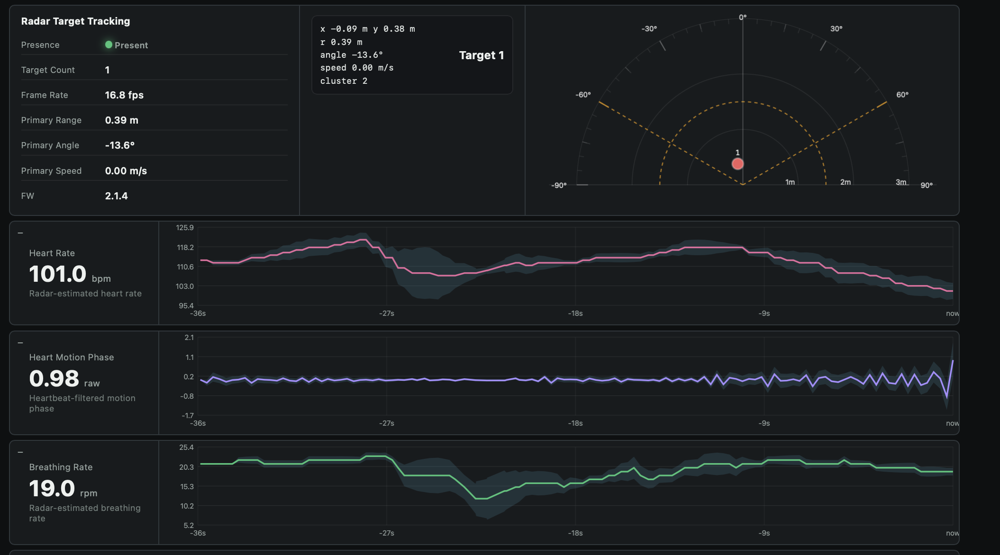
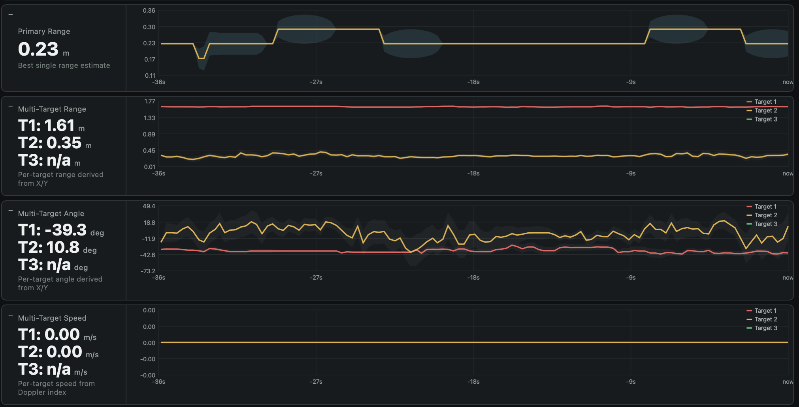
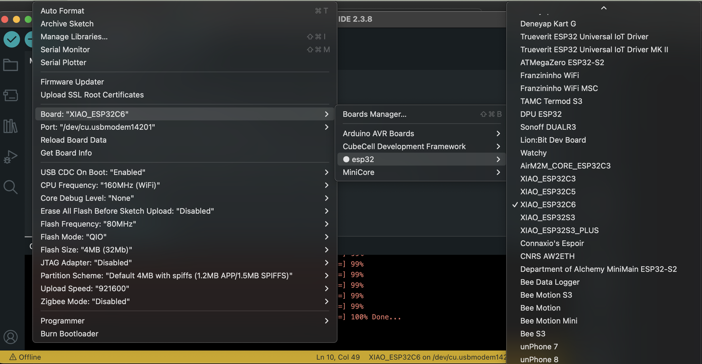
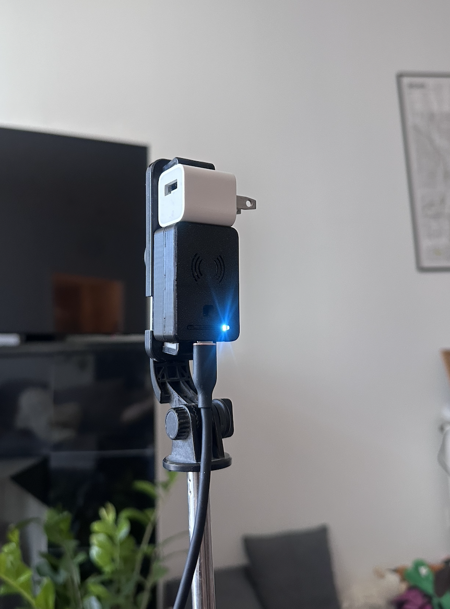
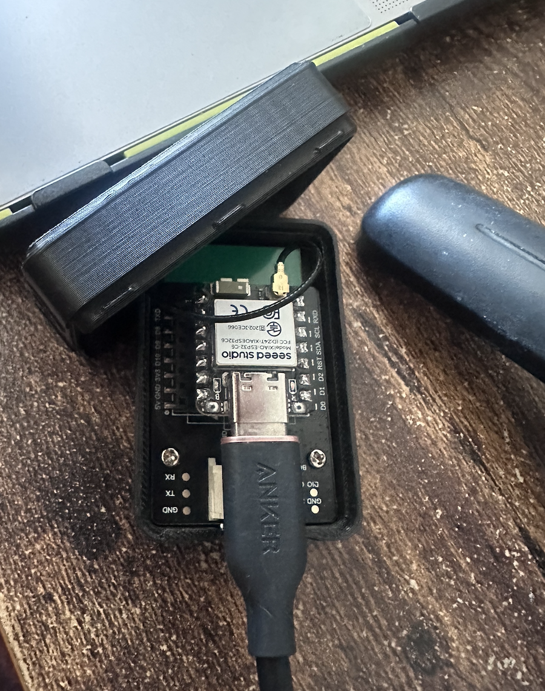

# MR60BHA2 Sensor VisLog

`MR60BHA2 Sensor VisLog` is a PlatformIO firmware and browser dashboard for the Seeed MR60BHA2 radar on a XIAO ESP32-C6. It is built for live sensing and logging, with two main application areas:

- rear-seat or baby monitoring: presence, count, position, and motion toward or away from the sensor
- bedside sleep or physiology monitoring: breathing rate, heart rate, and motion phase

This is an experimental sensing project, not a safety-certified child monitor or a medical device.

## What It Measures

- Presence and target count
- Range, angle, and speed for up to three tracked targets
- Heart rate and breathing rate
- Heart, breathing, and total motion phase
- Ambient light from a BH1750 sensor
- RGB LED status and threshold rules

## Repo Layout

```text
firmware/mr60bha2_console/
  platformio.ini
  src/main.cpp
  data/index.html
quicksetup/
  legacy Arduino sketch and notes
docs/images/
  screenshots and setup photos used below
```

## Quick Setup

1. Open `firmware/mr60bha2_console` in PlatformIO.
2. Build and flash:
   ```sh
   pio run
   pio run --target upload
   pio run --target uploadfs
   pio device monitor
   ```
3. Connect to Wi-Fi:
   - SSID: `MR60BHA2-Bench`
   - Password: `mr60bench`
   - UI: `http://192.168.4.1/`
   - OTA password: `mr60ota`

If you prefer the Arduino IDE path, the setup screenshots below show the board and port settings that were used while bringing the hardware up.

## Why This Repo Exists

The dashboard is useful whenever you want short-range radar sensing without contact:

- detect whether someone is present
- tell whether motion is closer or farther from the sensor
- separate multiple targets in the same space
- trend breathing and heart data when the subject is still and within range

For best physiological readings, keep the subject still and roughly chest-facing the sensor at about 0.4 to 1.5 m.

## Reference Images

All images below are copied into `docs/images/` and re-saved without embedded EXIF or location metadata.

### 1. Radar target tracking



This is the main live dashboard view for one subject. It shows presence, target count, range, angle, speed, and the heart and breathing plots in one place.

### 2. Multi-target tracking


This view shows two separate targets at once. Use it to validate multi-person tracking, such as rear-seat occupancy or room monitoring.

### 3. LED control and rule mode


This screen sets the LED manually or ties it to a sensor threshold. It is useful for quick visual feedback without opening the dashboard.

### 4. Session logger


This screen records named test sessions and exports JSON. It is useful for labeled experiments and later analysis.

### 5. Range, angle, and speed history



This view is the best quick check for movement. It shows whether targets are stable, shifting position, or moving toward and away from the sensor.

### 6. Arduino IDE upload


This shows the XIAO ESP32-C6 selected and a successful upload session. It is a reference for the Arduino IDE workflow.

### 7. Arduino IDE board settings



This shows the board profile and flash settings used during setup. It helps if the IDE does not auto-select the correct XIAO profile.

### 8. Hardware overview


This photo shows the assembled radar module on a small stand with USB power. It gives a clear sense of the final physical footprint.

### 9. Mounted side view



This side view shows the sensor mounted vertically with the front face exposed. It is a good reference for aim, cable routing, and spacing.

### 10. Open enclosure



This photo shows the internal enclosure layout with the board, cable, and module visible. Use it if you are rebuilding the enclosure or checking the wiring path.

## Hardware

- MR60BHA2 radar module on UART
- XIAO ESP32-C6 for Wi-Fi, USB serial, and local control
- BH1750 light sensor on I2C
- WS2812 RGB LED for local status

## Notes

- The browser UI is served from LittleFS at `http://192.168.4.1/`.
- The legacy Arduino sketch is still available under `quicksetup/` for reference.
- Most of the implementation details live in `firmware/mr60bha2_console/src/main.cpp`.
