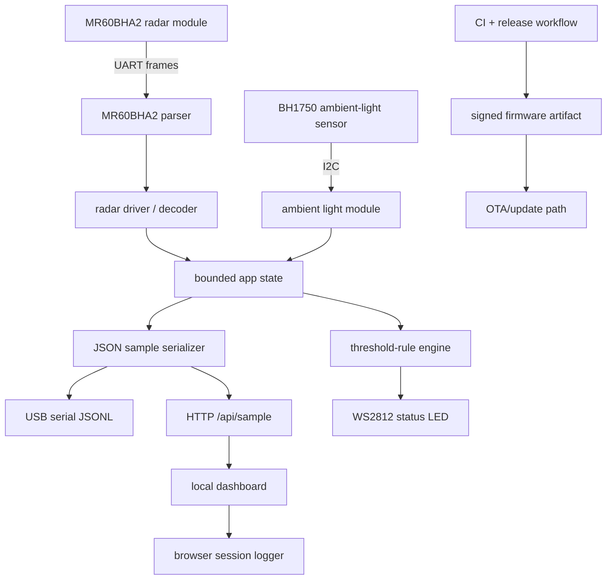

# Software Architecture

mmWaveVizLog is the embedded sensing software platform for a compact mmWave radar system. This repository focuses on firmware, protocol, validation, release management, and developer workflow. Mechanical enclosure, battery, thermal, wearable industrial design, and product integration work belong in a separate hardware/product repository.

## Scope

In scope for this repository:

- Zephyr runtime firmware for XIAO ESP32-C6
- Arduino quick-start firmware for first boot and hardware bring-up
- MR60BHA2 UART frame parsing
- BH1750 I2C ambient-light integration
- WS2812 status LED and threshold-rule logic
- JSON sample stream and HTTP API contracts
- Local dashboard and browser-side session logging
- Parser tests, schema validation, firmware CI, and release artifacts

Out of scope for this repository:

- wearable enclosure design
- battery sizing and charging architecture
- thermal enclosure design
- adhesive, skin-contact, or mounting design
- clinical validation or diagnostic claims
- manufacturing documentation for a finished wearable product

## High-Level Architecture

## Runtime Paths

| Path | Role |
| --- | --- |
| `zephyr/mmwavevizlog-runtime/` | Maintained product/runtime firmware path. This is the source of truth for firmware builds, parser tests, release artifacts, and protocol-aligned runtime work. |
| `arduino/mmwavevizlog-quickstart/` | Quick-start bring-up path. Use this to validate wiring, board setup, Wi-Fi AP behavior, OTA visibility, LED behavior, and dashboard operation before using the Zephyr runtime. |
| `protocol/` | JSON schema, serial protocol notes, and sample payload examples. |
| `docs/` | Software architecture, requirements, validation, release management, and dashboard/API validation. |

## Data Flow

1. The MR60BHA2 sends binary radar frames over UART.
2. The parser converts the byte stream into validated frames.
3. The radar driver decodes frame payloads into typed measurements.
4. The app-state layer stores the latest bounded measurement snapshot.
5. The JSON serializer emits schema-compatible samples.
6. The HTTP API and serial stream expose the same sample model.
7. The dashboard visualizes the stream and can export session JSON.
8. The LED threshold engine converts selected measurements into local feedback.

## Reliability Strategy

The software is structured around repeatable checks:

- parser executable tests for saved radar frames
- JSON schema validation for protocol examples
- Zephyr firmware build for the target board
- signed firmware artifact verification in the release workflow
- advisory Twister coverage for Zephyr harness visibility

## Interface Boundaries

| Interface | Owner | Contract |
| --- | --- | --- |
| MR60BHA2 UART | firmware parser/driver | binary frame format, checksums, frame-ready events |
| BH1750 I2C | ambient-light module | lux value or unavailable state |
| JSON sample | protocol layer | `protocol/sample.schema.json` |
| HTTP dashboard API | network/dashboard layer | `/api/sample` plus LED control endpoint |
| Release artifacts | CI/release workflow | signed firmware binary, ELF, map, parser executable, schema, examples |

## Design Principles

- Keep the Zephyr runtime as the maintained path.
- Keep Arduino useful for fast hardware bring-up, but avoid treating it as the long-term product runtime.
- Keep protocol output schema-compatible across firmware paths.
- Keep release artifacts reproducible through CI.
- Keep clinical and wearable-product claims out of this software repository unless supported by a separate validation and hardware repository.
