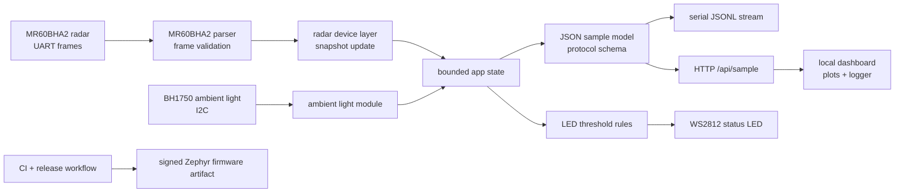

# Software Architecture

mmWaveVizLog is scoped as an embedded sensing software platform for a compact mmWave radar system. This repository owns firmware, protocol, validation, release, and developer workflow. Mechanical enclosure, battery, thermal, charging, and wearable industrial-design work are intentionally handled in a separate product/hardware repository.

## Runtime split

| Path | Role |
| --- | --- |
| `zephyr/mmwavevizlog-runtime/` | Maintained product/runtime firmware path for XIAO ESP32-C6. |
| `arduino/mmwavevizlog-quickstart/` | Quick-start bring-up and hardware-reference path for first boot, sensor wiring checks, dashboard checks, and OTA/UI experiments. |

## System view

## Software responsibilities

- Decode byte-oriented radar frames without blocking the sample loop.
- Normalize radar outputs into a bounded, schema-compatible state object.
- Preserve null/stale handling so downstream tools can distinguish missing data from zero values.
- Expose the same sample model over serial JSONL and local HTTP.
- Keep the browser dashboard as a debugging and capture tool, not as the firmware source of truth.
- Build, test, and package firmware through CI.

## Out of scope for this repository

- Battery sizing and charging architecture.
- Thermal enclosure design.
- Skin interface, adhesives, and comfort studies.
- Mechanical CAD and DFM package.
- Clinical validation or medical-device claims.

Those topics should be referenced from this repo only when they affect firmware interfaces or validation requirements.
