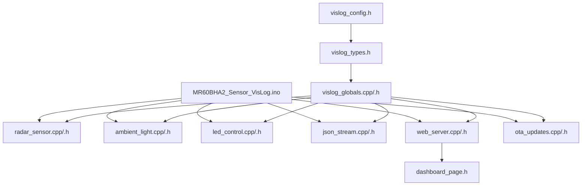

# MR60BHA2 Sensor quick setup

A minimal Arduino bring-up reference for the Seeed Studio MR60BHA2 mmWave radar module running on a XIAO ESP32-C6. The device creates its own Wi-Fi access point and serves a local web dashboard for live radar, bio-signal, target tracking, ambient light, status LED rules, and session logging.



## What it does

This sketch turns the XIAO ESP32-C6 into a local sensor test bench:

- Reads MR60BHA2 radar data over UART.
- Displays heart rate, breathing rate, radar range, presence, raw phase, breathing phase, and heart phase.
- Reads multi-target data when available from the radar target/point-cloud APIs.
- Reads ambient light from a BH1750 sensor over I2C.
- Hosts a browser dashboard at `http://192.168.4.1/`.
- Shows live plots with optional rolling noise/stability bands.
- Draws a radar-style target view with range rings and target dots.
- Controls a WS2812/RGB LED manually or from threshold rules.
- Logs raw JSON samples from the browser and exports them as a `.json` file.
- Supports Arduino OTA updates once the sketch is running.

## Important behavior notes

The multi-target list is frame-based. `Target 1`, `Target 2`, and `Target 3` are the first, second, and third targets reported in the current radar packet. They are not guaranteed persistent identities, so two people can swap target numbers between frames.

The sketch keeps a primary target summary using the first target in the packet. For multi-person testing, use the individual target cards and multi-target plots rather than assuming `Target 1` is always the same person.

## Repository Layout

```text
quicksetup/MR60BHA2_Sensor_VisLog/
  MR60BHA2_Sensor_VisLog.ino
  vislog_config.h
  vislog_types.h
  vislog_globals.cpp
  vislog_globals.h
  radar_sensor.cpp
  radar_sensor.h
  ambient_light.cpp
  ambient_light.h
  led_control.cpp
  led_control.h
  json_stream.cpp
  json_stream.h
  web_server.cpp
  web_server.h
  ota_updates.cpp
  ota_updates.h
  dashboard_page.h
  README.md
```

## Hardware

Tested target setup:

| Part | Purpose |
|---|---|
| Seeed Studio XIAO ESP32-C6 | Main microcontroller, Wi-Fi access point, dashboard server |
| Seeed MR60BHA2 mmWave module | Heart, breathing, range, presence, and target data |
| BH1750 light sensor | Ambient light measurement over I2C |
| WS2812/RGB LED | Device status and threshold feedback |
| USB-C cable | Power/programming |
| Breadboard/jumper wires or custom carrier | Wiring and prototyping |

## Pin configuration

These are the default pins used by the sketch:

| Signal | XIAO ESP32-C6 pin in code | Connects to |
|---|---:|---|
| Radar UART RX | `17` | MR60BHA2 TX |
| Radar UART TX | `16` | MR60BHA2 RX |
| Status RGB LED | `1` | WS2812/RGB LED data pin |
| I2C SDA | `22` | BH1750 SDA |
| I2C SCL | `23` | BH1750 SCL |
| I2C address | `0x23` | BH1750 default address |

Also connect `3V3`/power and `GND` between the XIAO, MR60BHA2, BH1750, and LED as required by your hardware. If your MR60BHA2 breakout requires 5 V, follow the module documentation and make sure UART logic levels are safe for the ESP32-C6.

## Software requirements

Install the following before uploading:

1. Arduino IDE or Arduino CLI.
2. ESP32 Arduino board package with XIAO ESP32-C6 support.
3. Seeed mmWave library that provides:
   - `Seeed_Arduino_mmWave.h`
   - `SEEED_MR60BHA2`
   - `PeopleCounting`
   - `TargetN`
4. Built-in ESP32/Arduino libraries used by the sketch:
   - `Arduino.h`
   - `ArduinoOTA.h`
   - `HardwareSerial.h`
   - `WebServer.h`
   - `WiFi.h`
   - `Wire.h`
   - `esp32-hal-rgb-led.h`

## Arduino IDE setup

1. Open the `quicksetup/MR60BHA2_Sensor_VisLog/` folder in Arduino IDE.
2. Select your board. Use `XIAO ESP32-C6` if available. If not, use the closest ESP32-C6 board profile that works with your installed board package.
3. Set the serial monitor to `115200 baud`.
4. Upload the sketch over USB.
5. Open the serial monitor. You should see startup messages showing the Wi-Fi network, local IP address, OTA hostname, and whether the BH1750 was found.

## Wi-Fi and dashboard

After upload, the XIAO creates its own Wi-Fi access point:

```text
SSID: mmWaveVisLog-MR60BHA2
Password: wirelessphysiology
Dashboard: http://192.168.4.1/
```

Connect your laptop or phone to that Wi-Fi network, then open the dashboard URL in a browser.

## Dashboard sections

### Connection + device status

Shows whether the browser is receiving live data, the current frame rate, firmware version, and radar status.

### Radar Target Tracking

Shows presence, target count, primary range/angle/speed, individual target cards, and a radar-style plot. The plot displays target dots in front of the sensor with range rings.

### Bio-signal measurements

Plots heart rate, breathing rate, raw motion phase, breathing motion phase, and heart motion phase.

### Range + motion

Plots primary range and per-target range, angle, and speed.

### Environment

Plots ambient light from the BH1750.

### Status LED Control

Lets you set the LED to solid, off, or breathing pulse mode.

### Sensor-to-LED Rule

Lets you map a selected measurement to LED colors using low/high thresholds. Example use cases:

- Turn LED red if target speed is below a threshold.
- Turn LED blue if target speed is above a threshold.
- Turn LED green/yellow/red based on breathing rate, heart rate, range, or light level.

### Session Logger

Records the JSON samples in the browser and exports a local `.json` file. This is useful for quick experiments without needing a separate SD card or server.

## API endpoints

### `GET /api/sample`

Returns the latest sensor state as JSON.

Common fields:

```json
{
  "heart_rate": 72.0,
  "breath_rate": 14.0,
  "distance": 1.25,
  "raw_distance": 125.0,
  "total_phase": 0.0,
  "breath_phase": 0.0,
  "heart_phase": 0.0,
  "presence": true,
  "presence_valid": true,
  "target_count": 1,
  "target_distance": 1.2,
  "target_angle": 4.5,
  "target_speed": 0.02,
  "targets": [],
  "light": 120.5,
  "frame": 1234,
  "uptime_ms": 60000
}
```

Fields may be `null` when the sensor has not reported a valid value yet.

### `POST /api/led`

Sets the LED mode or threshold rule.

Solid color example:

```json
{
  "mode": "solid",
  "brightness": 0.35,
  "r": 40,
  "g": 190,
  "b": 100
}
```

Threshold rule example:

```json
{
  "mode": "rule",
  "metric": "target_speed",
  "low": -0.05,
  "high": 0.05,
  "low_r": 255,
  "low_g": 0,
  "low_b": 0,
  "ok_r": 0,
  "ok_g": 0,
  "ok_b": 0,
  "high_r": 0,
  "high_g": 80,
  "high_b": 255
}
```

## OTA updates

OTA is enabled after the device boots.

```text
OTA hostname: mmWaveVisLog-MR60BHA2-OTA
OTA password: wp-ota
```

Use OTA only on a trusted local network. The access point password and OTA password are hard-coded in the sketch, so change them before using this outside a controlled test setup.

## Data interpretation

### Distance units

Some firmware/library combinations report distance in centimeters even when examples imply meters. The sketch normalizes suspiciously large range values by dividing by 100 and rejects values outside the configured valid range.

Default valid range:

```cpp
static constexpr float MAX_VALID_RADAR_RANGE_M = 6.0f;
```

### Target coordinates

Target `x` and `y` are normalized to meters if the raw values look like centimeters. Range and angle are derived from `x` and `y`:

```cpp
distance = hypotf(x, y);
angle = atan2f(x, y) * 180.0f / PI;
```

### Target speed

Target speed is estimated from Doppler index using the library-provided `RANGE_STEP` value:

```cpp
speed = dop_index * RANGE_STEP / 100.0f;
```

## Troubleshooting

### I can upload, but the dashboard does not load

- Make sure your computer/phone is connected to `VisLog-MR60BHA2` Wi-Fi.
- Open `http://192.168.4.1/` exactly.
- Check the serial monitor for the softAP IP address.

### Dashboard loads, but data says offline

- Check radar power and ground.
- Check UART wiring: XIAO RX must connect to radar TX, and XIAO TX must connect to radar RX.
- Confirm the radar UART baud rate is `115200`.
- Confirm the MR60BHA2 library version supports the functions used in this sketch.

### BH1750 says not found

- Check SDA/SCL wiring.
- Confirm the BH1750 address is `0x23`.
- Some BH1750 boards can use `0x5C` depending on the ADDR pin. Change `AMBIENT_LIGHT_I2C_ADDRESS` if needed.

### LED does not work

- Confirm the data pin matches `STATUS_LED_PIN`.
- Confirm the LED has proper power and ground.
- Some XIAO boards use a different onboard RGB LED pin or LED type. If the LED does not respond, verify the board-specific LED support for `rgbLedWrite()`.

### Target numbers jump around

This is expected. Target order is determined by the current radar packet and may change between frames. Do not treat `Target 1` as a persistent person ID.

## Things to customize

At the top of the sketch, these are the most common settings to edit:

```cpp
static constexpr int RADAR_RX_PIN = 17;
static constexpr int RADAR_TX_PIN = 16;
static constexpr int STATUS_LED_PIN = 1;
static constexpr int I2C_SDA_PIN = 22;
static constexpr int I2C_SCL_PIN = 23;
static constexpr uint8_t AMBIENT_LIGHT_I2C_ADDRESS = 0x23;
static constexpr float MAX_VALID_RADAR_RANGE_M = 6.0f;

static const char *WIFI_AP_SSID = "VisLogMR60BHA2";
static const char *WIFI_AP_PASSWORD = "wirelessphysiology";
static const char *OTA_HOSTNAME = "VisLogMR60BHA2-OTA";
static const char *OTA_PASSWORD = "wp-ota";
```

## Recommended experiment workflow

1. Upload the sketch.
2. Open serial monitor at 115200 baud.
3. Connect to the device Wi-Fi.
4. Open the dashboard.
5. Stand still at known distances and verify primary range.
6. Add a second person and observe target count and target swapping.
7. Start recording.
8. Run a short controlled test.
9. Export JSON.
10. Compare range, angle, speed, heart rate, breathing rate, and phase values offline.

## File structure

```text
MR60BHA2_Sensor_VisLog/
├── MR60BHA2_Sensor_VisLog.ino
└── README.md
```
